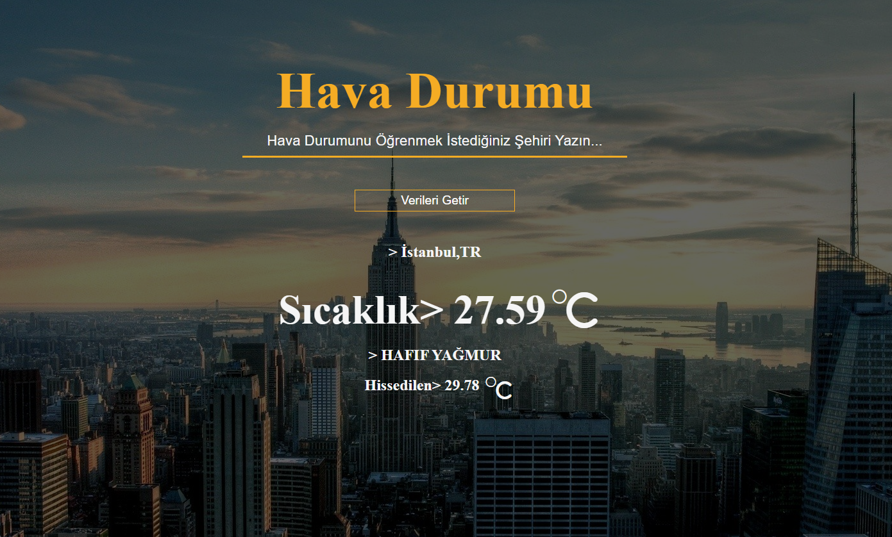

## 

---

# Hava durumu çalısması

---

## [Şuradan hesap açıp Api key alabilirsiniz.](https://openweathermap.org/api)

## script.js dosyasında getData fonksiyonundaki API kısmına anahtarı giriniz.

---
